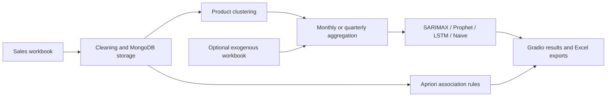

# Demand Forecasting & Market Basket Analysis

A Python final-year project by **Billy Suryono Hadisahputra** that brings sales forecasting, product grouping, and purchase-pattern analysis into a Gradio interface.

The project explores how historical transaction data can support inventory planning: estimate future product demand, compare forecasting approaches, and identify products that are purchased together.

## Features

- **Monthly and quarterly forecasting:** separate implementations for two planning horizons.
- **Model comparison:** SARIMAX, Prophet, LSTM, and a naive baseline, with error calculations that combine mean absolute error and absolute bias.
- **Exogenous inputs:** unit price and discount data, with an optional workbook for external variables.
- **Product clustering:** TF-IDF representations of product names and K-means, selecting cluster counts using silhouette scores.
- **Market basket analysis:** Apriori frequent itemsets and association rules.
- **Interactive workflow:** upload sales workbooks, select product categories, generate forecasts, inspect plots, and download Excel reports.
- **Persistence:** MongoDB collections for sales, predictions, model reports, and association analysis.

## Workflow



## Repository layout

| File | Purpose |
| --- | --- |
| `code/Proyek Akhir.py` | Monthly forecasting and analysis application |
| `code/Proyek Akhir Quarterly.py` | Quarterly forecasting and analysis application |
| `requirements.txt` | Dependencies inferred from source imports |

## Run locally

Install Python and start a local MongoDB server at `mongodb://localhost:27017/`. Both applications use the `final_project` database, so they share stored history.

From the repository root, create and activate a virtual environment:

```powershell
python -m venv .venv
.\.venv\Scripts\Activate.ps1
python -m pip install -r requirements.txt
python "code/Proyek Akhir.py"
```

For the quarterly version, run this instead:

```powershell
python "code/Proyek Akhir Quarterly.py"
```

Open the local URL printed by Gradio. Upload a compatible sales workbook in the **Data Penjualan** tab, then use **Forecast** or **MBA Analysis**.

## Input data

The sales importer expects these Excel column names:

| Column | Meaning |
| --- | --- |
| `Tanggal Penjualan` | Sale date, as text such as `01 Jan 2023` |
| `Nama Pelanggan` | Customer identifier |
| `Nama Item` | Product name |
| `Jumlah Item` | Quantity |
| `Harga Satuan` | Unit price |
| `Diskon` | Discount |
| `Grand Total` | Transaction total |

The importer was written for the original workbook's text and numeric conventions. Its string conversions may need adjustment for other Excel exports. The monthly forecasting workflow selects products present in both 2023 and 2024 and requires at least 24 monthly observations. An optional exogenous workbook uses its first column as dates and the following one or two columns as explanatory variables.

## Project status and limitations

This repository presents the original academic prototype. The dependency list is not a lockfile; the original package versions were not recorded, and installation and end-to-end execution have not been validated for this portfolio release. Database access occurs during application startup, and the UI is intended for local use.

The source demonstrates model implementation and comparison, but this README makes no claim that a particular model is best or that the system achieved a measured business improvement. Reproducing experimental results requires the original data and environment.

Original sales workbooks, analysis exports, signed academic documents, backups, and third-party reference PDFs are excluded from publication. No original business or customer dataset is supplied.

## Technical skills demonstrated

Python application development, pandas data preparation, time-series modeling, neural networks, unsupervised learning, association-rule mining, MongoDB persistence, and Gradio interface development.
