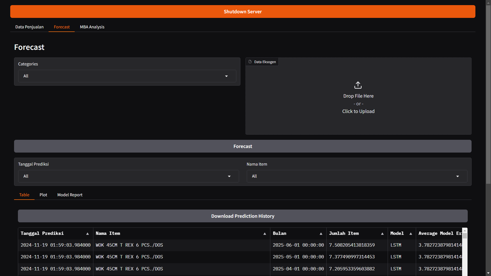
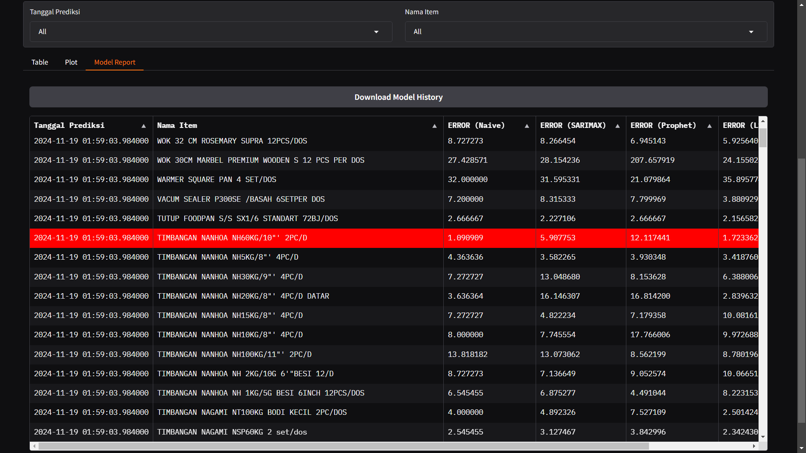
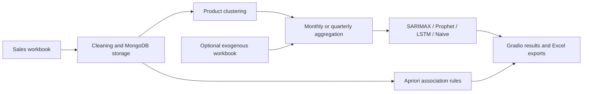

# Demand Forecasting & Market Basket Analysis

A Python application by **Billy Suryono Hadisahputra**, developed for the CV Kita Jaya undergraduate thesis. It compares Naive, SARIMAX, Prophet and LSTM forecasts product by product, presents results in Gradio, and stores sales and analysis history in MongoDB.

## Business problem

Inventory planners must balance uncertain demand against overstocking and stockouts. This project turns historical sales, unit prices and discounts into product-level forecasts, model comparisons and purchase-pattern analysis. It supports inventory decisions; it does not claim a measured reduction in stockouts or inventory costs after deployment.

## Application preview

Select a product category, optionally supply exogenous inputs, run forecasts, and inspect tables, plots and model reports.



Compare model errors by product and export the model history to Excel.



These screenshots show the forecasting interface and product-level model comparison. The raw sales-import screenshot is omitted because it contains transaction records.

## Features

- Monthly and quarterly forecasting implementations.
- Naive, SARIMAX, Prophet and LSTM comparison and per-product selection.
- Unit-price and discount inputs, plus optional external-variable workbooks.
- TF-IDF product-name features and K-means grouping with silhouette-based cluster selection.
- Apriori frequent itemsets and association rules, including support, confidence and lift.
- Gradio sales upload, category selection, forecast tables, plots and Excel downloads.
- MongoDB persistence for sales, predictions, model reports and association analysis.

## Workflow



## Run locally

The author confirms that the application runs in their local environment. The dependency list is not a version lockfile, so compatibility can vary with package versions. MongoDB must be running at `mongodb://localhost:27017/` before application startup.

Clone the repository:

```powershell
git clone https://github.com/billysuryono1412-code/demand-forecasting-app.git
```

Enter the project:

```powershell
cd demand-forecasting-app
```

Create an environment:

```powershell
python -m venv .venv
```

Install dependencies:

```powershell
.\.venv\Scripts\python.exe -m pip install -r requirements.txt
```

Run the monthly application:

```powershell
.\.venv\Scripts\python.exe code/demand_forecasting_monthly.py
```

For quarterly forecasting, run `code/demand_forecasting_quarterly.py` instead. On Linux/macOS, use `.venv/bin/python` in place of `.\.venv\Scripts\python.exe`.

## Try the synthetic demo

1. Use a disposable local MongoDB instance: the app writes to its configured databases and retains imported rows.
2. Open the local Gradio URL printed in the terminal.
3. In **Data Penjualan**, upload [examples/synthetic_sales_demo.xlsx](examples/synthetic_sales_demo.xlsx).
4. Open **Forecast**, choose one category for a first run, leave the optional external-variable upload empty, then run the forecast.
5. Inspect **Table**, **Plot** and **Model Report**; use **MBA Analysis** for purchase-pattern analysis.

The workbook contains **360 fabricated rows, six products and 60 months (2020–2024)**. It includes repeat customer/product pairs and seasonal and trend variation. It is designed to meet the current history and year filters, not to reproduce thesis scores or demonstrate real business accuracy. Model fitting can still take time because the app performs parameter searches.

The importer and history filters have been checked against this workbook separately from a full training/UI run. See [examples/README.md](examples/README.md) for format details.

## Sales workbook schema

The first sheet must contain these columns. The two identifier columns are necessary for MongoDB upserts even though the importer's initial required-column check does not list them.

| Column | Meaning |
| --- | --- |
| `Tanggal Penjualan` | Text date such as `15 Jan 2023` |
| `Nomor Penjualan` | Sales ID; shared by items in one sale |
| `Kode Item` | Stable item code; sales-ID/item-code pairs must be unique |
| `Nama Pelanggan` | Customer identifier |
| `Nama Item` | Product name |
| `Jumlah Item` | Quantity |
| `Harga Satuan` | Unit price; renamed to `exog1` |
| `Diskon` | Discount input; renamed to `exog2` |
| `Grand Total` | Amount field parsed and stored by the importer |

The importer was written for the original workbook conventions. It accepts float numeric columns or specific formatted text; integer-typed numeric columns can reach a string-conversion branch. The demo deliberately uses fractional numeric values to avoid that branch. Its quantities represent synthetic half-lots, not fractional individual kitchenware items.

Current code selects products present in both 2023 and 2024. The monthly workflow requires at least 24 monthly observations; the quarterly workflow requires at least eight quarters. A larger or differently dated dataset may need filter changes. Optional external-variable workbooks use the first column as dates and the next one or two as numeric inputs.

## Repository layout

| Path | Purpose |
| --- | --- |
| `code/demand_forecasting_monthly.py` | Monthly application |
| `code/demand_forecasting_quarterly.py` | Quarterly application |
| `requirements.txt` | Python dependencies |
| `examples/synthetic_sales_demo.xlsx` | Fabricated upload data |
| `docs/images/` | Original application screenshots |

## Scope and limitations

This is a local research application, not a hardened multi-user production service. Original sales workbooks and customer records are excluded. Results depend on the dataset and experimental setup and are not evidence of universal model superiority. Synthetic demo results must not be presented as real-company findings.

## License

See [LICENSE](LICENSE) for the repository's code license. The included demo data is fully synthetic, and the screenshots show the author's application.
